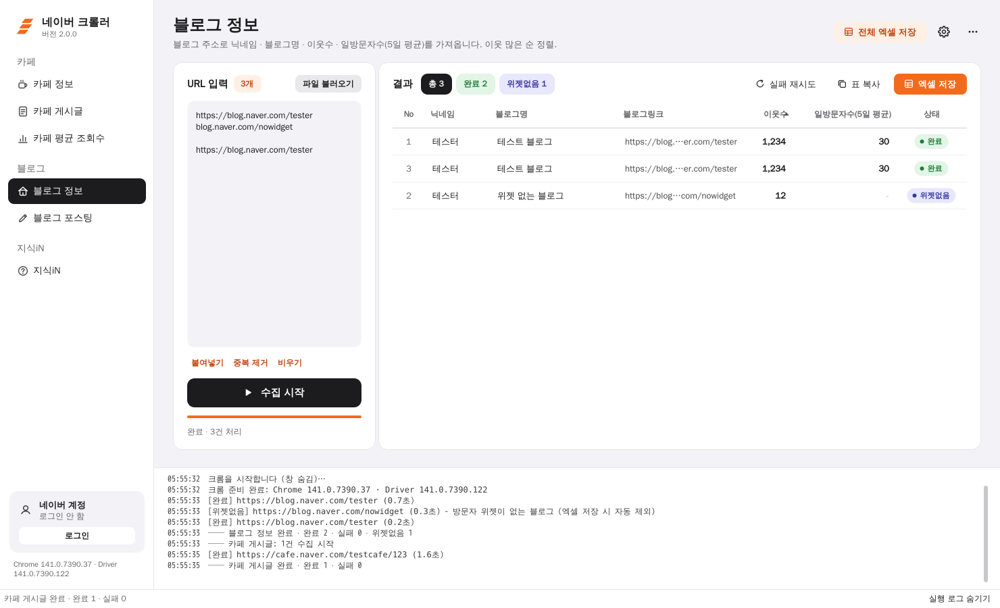
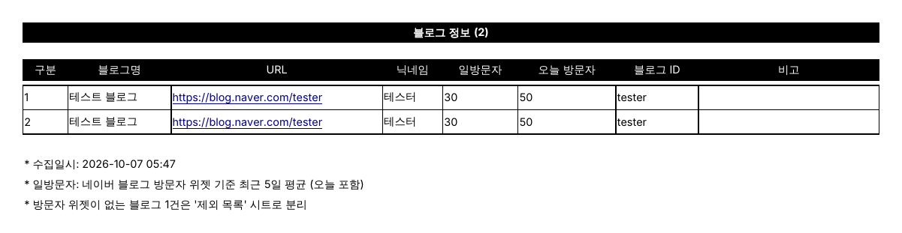

# 네이버 크롤러 2.0

네이버 **카페 · 블로그 · 지식iN** 지표를 URL 목록으로 한 번에 모아 엑셀로 내보내는 윈도우 프로그램.
기존 `크롤링 프로그램.exe`(Python 3.10 + tkinter + Selenium 구버전)를 새로 만든 버전.



## 기존 버전 대비 바뀐 점

| | 기존 | 2.0 |
|---|---|---|
| 크롬 호환 | 크롬 115 이후 실행 안 됨 (webdriver_manager 구버전) | **Selenium Manager 가 설치된 크롬 버전(155 포함)에 맞는 드라이버 자동 설치** |
| 화면 | 탭마다 텍스트 칸 나열, 수집 중 창 멈춤 | 사이드바 + 결과 표, 백그라운드 수집, 진행률 · 중지 · 실패 재시도 |
| 결과 | 칸별 `복사` 버튼 | 팀 리스트 양식 그대로 **엑셀 저장**, 표 복사(엑셀 붙여넣기용) |
| 링크 입력 | 한 줄에 하나 | 글이 섞인 텍스트 · **txt / csv / xlsx 파일**에서 링크만 자동 추출, naver.me 단축링크 지원 |
| 방문자 위젯 없는 블로그 | 0 나누기 오류로 전체 멈춤 | `위젯없음` 처리 후 계속 진행, 엑셀 본 시트에서 자동 제외 → `제외 목록` 시트 |
| 로그인 | 매번 새 크롬 | 전용 크롬 프로필에 **네이버 로그인 유지** (회원 전용 카페 글) |
| 네이버 화면 변경 | 다시 빌드해야 함 | 화면 요소 + 내부 API 응답 + 본문 텍스트 순으로 여러 방법 시도, 선택자는 설정 파일로 수정 가능 |

## 수집 항목

| 메뉴 | 입력 URL | 결과 |
|---|---|---|
| 카페 정보 | `cafe.naver.com/카페주소` | 카페명, 회원수, 카페 ID |
| 카페 게시글 | `cafe.naver.com/카페주소/글번호` (신·구 주소 모두) | 제목, 닉네임, 조회수, 댓글수, 좋아요, 작성일 |
| 카페 평균 조회수 | `cafe.naver.com/카페주소` | 전체글보기 N페이지(기본 10페이지 · 15개, 공지 제외) 평균 조회수 |
| 블로그 정보 | `blog.naver.com/아이디` | 닉네임, 블로그명, 이웃수, 일방문자수(방문자 위젯 5일 평균) · **크롬 없이 4개씩 동시 처리** |
| 블로그 포스팅 | `blog.naver.com/아이디/글번호` (모바일 주소 포함) | 제목, 닉네임, 공감수, 댓글수, 작성일 |
| 지식iN | `kin.naver.com/qna/detail.naver?...` | 제목, 조회수 |

## 설치

### A. exe 만들기 (권장)
1. [Python 3.10 이상](https://www.python.org/downloads/) 설치 — 설치 화면에서 **Add python.exe to PATH** 체크
2. 이 저장소를 내려받아(Code → Download ZIP) 압축 풀기
3. `build.bat` 더블클릭 → 끝나면 `dist\NaverCrawler.exe` 생성 (exe 하나만 옮겨 써도 됨)

> GitHub 저장소의 **Actions → Build Windows exe → Run workflow** 로 만들어진 exe 를 내려받을 수도 있다 (선택 사항).

### B. 빌드 없이 바로 실행
`run.bat` 더블클릭 (처음 한 번 패키지 설치).

크롬은 평소 쓰는 정식 크롬이 설치돼 있으면 된다. 드라이버는 첫 수집 때 자동으로 받는다 (인터넷 필요).

## 사용법

1. 왼쪽에서 작업 선택
2. URL 붙여넣기 — 메모 · 이메일 · 설명이 섞여 있어도 링크만 골라 읽음
   - `파일 불러오기` 버튼 또는 입력칸에 txt / csv / xlsx 파일을 끌어다 놓기
   - `#` 으로 시작하는 줄은 무시
3. **수집 시작** (Ctrl+Enter) → 결과 표가 실시간으로 채워짐
4. **엑셀 저장** (현재 탭) / **전체 엑셀 저장** (모든 탭을 시트별로 한 파일)

- 가입이 필요한 카페: 왼쪽 아래 **로그인** 을 한 번 해두면 다음 실행에도 유지됨 (평소 크롬과 분리된 전용 프로필)
- 표에서 마우스 오른쪽: 열 전체 복사, 브라우저로 열기, 선택 행 다시 수집 · 삭제
- 실패 사유는 상태 칸에 마우스를 올리거나 하단 `실행 로그 보기` 에서 확인
- 설정(톱니바퀴): 크롬 창 숨기기, URL 사이 대기 시간(기본 1초), 페이지 대기 시간, 드라이버 경로 직접 지정

## 엑셀 양식

팀 리스트 양식(B열 시작, 검정 제목줄 `제목 (건수)`, 검정 머리글, 얇은 테두리, 8pt)에 맞춰 저장된다.
상태는 색 대신 `비고` 열에 글로 남고(실패 사유, 누락 항목), 표 아래 `*` 주석에 수집일시와 기준이 들어간다.
파일 이름: `네이버크롤링_탭이름_YYMMDD.xlsx`



## 네이버 화면이 바뀌어서 값이 안 나올 때

- `⋯ → 선택자 설정 파일 열기` 로 `%APPDATA%\NaverCrawler\selectors.json` 을 열어 CSS 선택자를 추가하면 다음 수집부터 적용 (앞에 적은 것부터 시도)
- `설정 → 실패한 페이지 HTML 저장` 을 켜면 `%APPDATA%\NaverCrawler\debug` 에 페이지가 저장된다 (원인 확인용)

## 문제 해결

| 증상 | 해결 |
|---|---|
| `ChromeDriver 를 준비하지 못했습니다` | 인터넷 연결 확인. 사내망이면 설정에서 `chromedriver.exe` 경로를 직접 지정 |
| `크롤러 전용 크롬 프로필이 이미 사용 중` | 이전에 열린 크롤러 크롬 창을 모두 닫고 다시 시도 |
| 회원 전용 카페 글이 `실패` | 왼쪽 아래 `로그인` 후 `실패 재시도` |
| 엑셀 저장 실패 | 같은 이름 파일이 엑셀에서 열려 있으면 닫고 다시 저장 |

## 개발

```
naver_crawler/
  crawlers.py   작업별 수집 로직 (화면 요소 → 내부 JSON → API → 본문 텍스트 순)
  browser.py    크롬 실행 · 프레임 전환 · 네트워크 응답 수집
  excel.py      엑셀 양식
  links.py      txt / csv / xlsx 에서 링크 추출
  selectors.py  기본 선택자 (+ 사용자 selectors.json 병합)
  ui/           PySide6 화면
tests/          단위 테스트 + 가짜 네이버 페이지(로컬 HTTPS)로 실제 크롬을 띄우는 통합 테스트
```

```bash
pip install -r requirements-dev.txt
pytest -q                                   # 단위 테스트
NC_TEST_CHROME=<chrome 경로> NC_TEST_DRIVER=<chromedriver 경로> pytest -q   # 브라우저 통합 테스트 포함
```

요청 간격을 너무 짧게 하면 네이버에서 접속을 제한할 수 있다. 기본값(1초) 이상을 권장.
